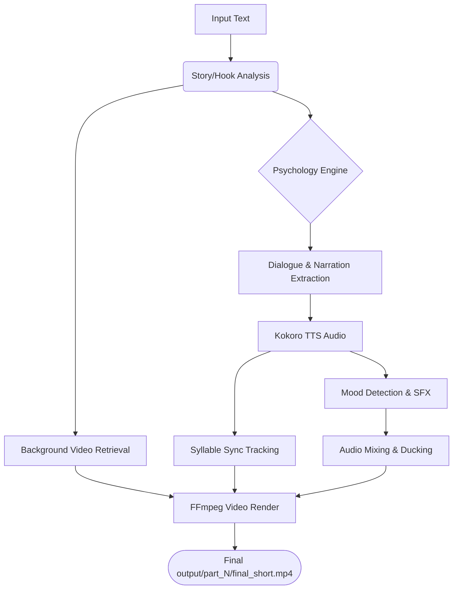

# 🎬 YouTube Shorts Generator — Snippet Stories

Automated YouTube Short generator for **"The Twice-Crowned King"** dark fantasy series.

## Project Structure

```
YT/
├── src/                          # Core pipeline source code
│   ├── __init__.py               # Package init
│   ├── generate_short.py         # ★ Main pipeline orchestrator
│   ├── config.py                 # All configuration & tuning knobs
│   ├── background_engine.py      # Pexels API + procedural backgrounds
│   ├── sfx_engine.py             # Mood-based sound effect generation
│   ├── mood_detector.py          # Keyword-based mood classification
│   ├── audio_processor.py        # Character FX, normalization, ducking
│   ├── subtitle_sync.py          # Frame-perfect ASS subtitle sync
│   ├── local_tts.py              # Kokoro TTS integration (emotional voices)
│   ├── kokoro_worker.py          # Persistent Kokoro model worker
│   ├── error_handler.py          # Error handling utilities
│   └── verify_dependencies.py    # Dependency checking utilities
│
├── tools/                        # Utility & batch scripts
│   ├── batch_generate.py         # Generate all parts in sequence
│   ├── split_story.py            # Split DOCX → input parts
│   ├── hook_rewriter.py          # AI hook rewriter (Ollama)
│   └── verify_system.py          # System verification
│
├── assets/                       # Brand assets
│   ├── watermark.png             # Channel watermark overlay
│   ├── banner.png                # YouTube banner
│   └── profile.png               # Channel profile photo
│
├── input/                        # Script input files (part_0001.txt, ...)
├── output/                       # Generated videos & metadata
├── sfx/                          # Generated sound effects cache
├── story/                        # Source DOCX story file
├── docs/                         # Documentation & original assets
├── .temp/                        # Temporary processing files
├── .cache/                       # Pexels video cache
└── requirements.txt              # Python dependencies
```

## 🚀 Step-by-Step Setup Guide

### 1. Prerequisites
- **Python 3.10+** (Install from python.org)
- **FFmpeg**: Required for media processing.
  - Windows: `winget install ffmpeg`
  - Mac: `brew install ffmpeg`
  - Linux: `sudo apt install ffmpeg`

### 2. Virtual Environment Setup
It is highly recommended to run this project inside a virtual environment to avoid dependency conflicts.
```bash
# Create Virtual Environment
python -m venv .kokoro_venv

# Activate Virtual Environment
# Windows:
.\.kokoro_venv\Scripts\Activate.ps1
# Mac/Linux:
source .kokoro_venv/bin/activate
```

### 3. Install Dependencies
```bash
pip install -r requirements.txt
```

### 4. Setup Kokoro (Local TTS)
Kokoro is the local neural TTS engine for emotional voice rendering.
- Ensure the `models/` directory exists.
- Download `kokoro-v1.0.onnx` and `voices.bin` (or similar necessary Kokoro weights) and place them in the `models/` folder.

### 5. Setup Ollama (Local AI Hook Rewriter)
Ollama runs lightweight LLMs locally for psychological hook analysis and dialogue selection without API costs.
- Download and install [Ollama](https://ollama.com/).
- Start the Ollama server: `ollama serve` (or let it run in the background).
- Pull the required model: `ollama pull llama3.2:3b`

### 6. Configuration (.env)
Create a `.env` file based on `.env.example` (or use the existing one) and fill in your keys:
- `PEXELS_API_KEY`: Get a free key from Pexels for background video fetching.
- `OLLAMA_URL`: Typically `http://localhost:11434`

## 🏗️ Architecture & Flow

### System Architecture
The system is built as a modular pipeline where each step passes data to the next via temporary files and in-memory structures:
1. **Input Parser**: Reads script/story text (e.g., `part_0001.txt`).
2. **Psychology Engine (Ollama)**: Analyzes text, extracts high-tension dialogue, and selects the best hooks.
3. **TTS Engine (Kokoro & Edge-TTS)**: Generates character-specific audio using the `kokoro_worker.py` for persistent, fast inference.
4. **Mood & SFX Engine**: Detects emotional tone (tense, calm, scary) and layers appropriate sound effects.
5. **Background Engine**: Fetches and caches contextual Pexels stock footage or generates procedural backgrounds.
6. **Subsync & Video Processor**: `librosa` maps audio syllables, generating strict exact SRT/ASS subtitle files. FFmpeg compiles video, audio, SFX, overlays, and text into the final MP4.

### Generation Workflow


## 🚀 Step-by-Step Generation Guide

1.  **Prepare Script**: Ensure your `.txt` files are in the `input/` folder.
2.  **Generate One Video**: Test the pipeline with Part 1:
    ```bash
    python src/generate_short.py input/part_0001.txt 1
    ```
3.  **Check Output**: Find your video in `output/part_0001/final_short.mp4`.
4.  **Scale Up**: Use the batch tool for the whole series:
    ```bash
    python tools/batch_generate.py --start 1 --end 10
    ```

## 🧠 Local AI Hook Rewriting (Psychology Engine)

The pipeline now uses a built-in **Psychology Engine** (`src/psychology_engine.py`) to automatically select high-tension dialogue and build "Open Loop" hooks. No manual Ollama intervention is required per part, but the system remains compatible with external rewriters.

## 📖 Command Reference

Grouped by task. Run these from the project root.

### 🛠️ System Setup
```bash
# 1. Activate Environment (Windows)
.\venv\Scripts\Activate.ps1

# 2. Install Primary Dependencies
pip install -r requirements.txt

# 3. Setup Kokoro TTS (MANDATORY for emotional voices)
# Ensure /models/ directory is present with .onnx and .bin files
```

### 🧠 AI & Model Setup (Ollama)
```bash
# Pull the required hook-rewriting model
ollama pull llama3.2:3b

# Check if Ollama is running
ollama serve
```

### 🎬 Video Generation
```bash
# 1. Generate a single part (Part 1)
python src/generate_short.py input/part_0001.txt 1

# 2. Generate a range of parts (Batch)
python tools/batch_generate.py --start 1 --end 10

# 3. Resume batch from specific part
python tools/batch_generate.py --start 50
```

### 📝 Content Preparation
```bash
# 1. Split DOCX story into text parts
python tools/split_story.py

# 2. Verify everything is installed correctly
python tools/verify_system.py
```

### 🧹 Maintenance & Cleanup
```bash
# Wipe all generated files, logs, and caches (Fresh Start)
powershell -Command "Remove-Item -Path '.cache', '.temp', 'logs', 'output' -Recurse -Force -ErrorAction SilentlyContinue; Get-ChildItem -Path . -Filter '__pycache__' -Recurse | Remove-Item -Force -Recurse -ErrorAction SilentlyContinue"

# Check log file for errors
Get-Content logs/generation.log -Wait
```

## Features

| Feature | Status | Description |
|---------|--------|-------------|
| **Emotional TTS** | ✅ | **[NEW]** Dynamic voice swapping based on segment mood (Kokoro-ONNX) |
| **Freeze-Free Video** | ✅ | **[STABILIZED]** Robust FFmpeg xfade logic with stream normalization |
| **2-Pass Render** | ✅ | Separate video+subs pass from audio mix (faster, debuggable) |
| **Natural Subtitles** | ✅ | Punctuation-aware chunking (no mid-sentence breaks) |
| **SFX Integration** | ✅ | Mood-based SFX placed on timeline with millisecond precision |
| **Robust Pexels** | ✅ | Automatic search retries & tier-3 nature fallbacks |
| **Visual Branding** | ✅ | Persistent watermark + CTA overlay + Part tag |
| **Loop Bridge** | ✅ | Echo opening audio at end → triggers replays |
| **Smart Backgrounds** | ✅ | Expanded story-aware whitelist (Academy, Palace, Mana) |
| **AI Disclosure** | ✅ | YouTube 2026 policy compliant overlay |

## Branding Strategy

> **No spoken intros/outros** — they kill retention on Shorts.

Instead, branding is 100% visual:
- **Watermark**: Channel logo in top-left corner (persistent, 70% opacity)
- **Part Tag**: "Part N" text in first 4 seconds
- **CTA Overlay**: "Like & Subscribe for Part N+1!" during final 3 seconds
- **Loop Bridge**: Audio loops seamlessly for re-watches

## Configuration

All settings are in [`src/config.py`](src/config.py). Key knobs:

```python
# TTS
USE_LOCAL_TTS = True       # Must be True for emotional depth

# Visual Branding
SHOW_CHANNEL_WATERMARK = True
SHOW_CTA_OVERLAY = True
SHOW_PART_TAG = True

# Audio
TTS_SPEED = 1.1            # Perfect pacing for retention
MUSIC_VOLUME = 0.10        # Background music level
```

## Dependencies

- **FFmpeg** (required): Video/audio processing
- **Python 3.10+**: Core runtime
- **Kokoro Models**: (Required) Place `kokoro-v1.0.onnx` in `models/`
- **Pexels API Key**: Background video footage (set in `.env`)
