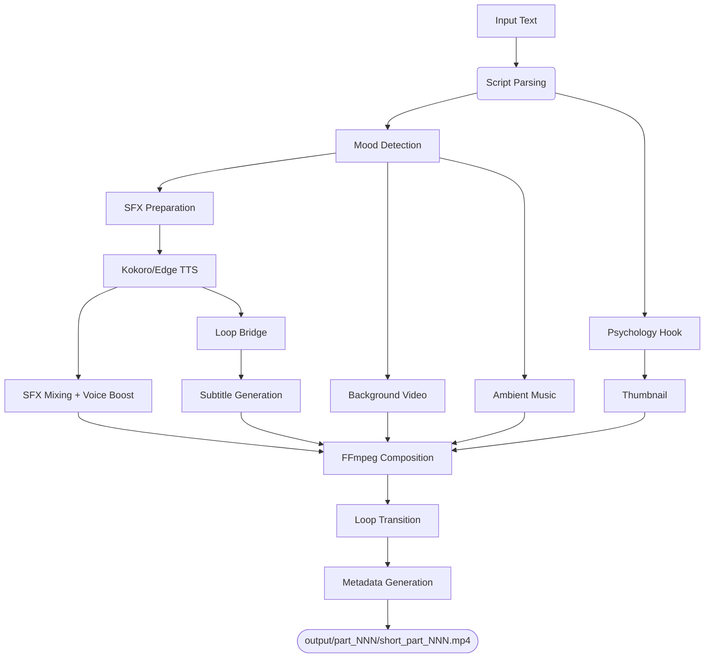

# 🎬 YouTube Shorts Generator — Snippet Stories

Automated YouTube Shorts generator for **"The Twice-Crowned King"** — a 192-part dark fantasy series.

> A Demon Emperor betrayed and reborn must survive an academy where humans, demons, and the Church wage a secret war.

## Project Structure

```
YT_Shorts/
├── src/                          # Core pipeline source code
│   ├── __init__.py               # Package init
│   ├── generate_short.py         # ★ Main pipeline orchestrator (11-step)
│   ├── config.py                 # All configuration & tuning knobs
│   ├── background_engine.py      # Pexels API + procedural backgrounds (Tier 0-3)
│   ├── psychology_engine.py      # Hook selection & open-loop optimization
│   ├── sfx_engine.py             # Mood-based sound effect generation
│   ├── mood_detector.py          # Keyword-based mood classification
│   ├── audio_processor.py        # Character FX, normalization, ducking
│   ├── subtitle_sync.py          # Frame-perfect ASS subtitle sync (librosa)
│   ├── local_tts.py              # Kokoro TTS integration (emotional voices)
│   ├── kokoro_worker.py          # Persistent Kokoro model worker
│   ├── error_handler.py          # Error handling utilities
│   └── verify_dependencies.py    # Dependency checking utilities
│
├── tools/                        # Utility & batch scripts
│   ├── batch_generate.py         # Parallel batch generation (ThreadPoolExecutor)
│   ├── split_story.py            # Split DOCX → input parts
│   ├── hook_rewriter_v2.py       # AI hook rewriter (Ollama)
│   └── verify_system.py          # System verification
│
├── assets/                       # Brand assets
│   ├── watermark.png             # Channel watermark overlay
│   ├── banner.png                # YouTube banner
│   └── profile.png               # Channel profile photo
│
├── input/                        # Script input files (part_0001.txt, ...)
├── output/                       # Generated videos & metadata (part_001/, part_002/, ...)
├── sfx/                          # Generated sound effects cache
├── story/                        # Source DOCX story file
├── docs/                         # Documentation & original assets
├── .temp/                        # Temporary processing files
├── .cache/                       # Pexels video cache
└── requirements.txt              # Python dependencies
```

## 🚀 Quick Start

### 1. Prerequisites
- **Python 3.10+** (Install from python.org)
- **FFmpeg**: Required for media processing.
  - Windows: `winget install ffmpeg`
  - Mac: `brew install ffmpeg`
  - Linux: `sudo apt install ffmpeg`

### 2. Virtual Environment Setup
```bash
# Create Virtual Environment
python -m venv venv

# Activate Virtual Environment
# Windows:
.\venv\Scripts\Activate.ps1
# Mac/Linux:
source venv/bin/activate
```

### 3. Install Dependencies
```bash
pip install -r requirements.txt
```

### 4. Setup Kokoro (Local TTS)
Kokoro is the local neural TTS engine for emotional voice rendering.
- Ensure the `models/` directory exists.
- Download `kokoro-v1.0.onnx` and `voices.bin` and place them in `models/`.

### 5. Setup Ollama (Local AI Hook Rewriter)
Ollama runs lightweight LLMs locally for psychological hook analysis.
- Download and install [Ollama](https://ollama.com/).
- Start the Ollama server: `ollama serve`
- Pull the required model: `ollama pull llama3.2:3b`

### 6. Configuration (.env)
Create a `.env` file and fill in your keys:
- `PEXELS_API_KEY`: Get a free key from [Pexels](https://www.pexels.com/api/) for background video fetching.
- `OLLAMA_URL`: Typically `http://localhost:11434`

## 🏗️ Architecture & Flow

### 11-Step Pipeline


### Key Technical Details
| Component | Technology | Notes |
|---|---|---|
| **TTS** | Kokoro-ONNX + Edge-TTS | Multi-character voices with emotional prosody |
| **Subtitles** | librosa onset detection | Frame-perfect word-level sync |
| **Backgrounds** | Pexels API + FFmpeg procedural | Dark fantasy keyword whitelist |
| **Audio Mix** | FFmpeg amix + volume boost | Voice pre-boosted to prevent 1/N attenuation |
| **Hooks** | Psychology Engine | Selects highest-intensity sentence from story middle |
| **Video** | FFmpeg filter_complex | Single-pass: subtitles + watermark + CTA + progress bar |
| **Output** | H.264 High 4.2, 30 FPS | YouTube Shorts optimized, ~10-20 MB per Short |

## 🎬 Usage

### Generate a Single Part
```bash
python src/generate_short.py input/part_0001.txt 1
```

### Generate a Range of Parts (Batch)
```bash
# Generate parts 1-10
python tools/batch_generate.py --start 1 --end 10

# Resume from where you left off
python tools/batch_generate.py

# Generate with 2 parallel threads
python tools/batch_generate.py --threads 2 --start 1 --end 5
```

### Content Preparation
```bash
# Split DOCX story into text parts
python tools/split_story.py

# Verify everything is installed correctly
python tools/verify_system.py
```

### Maintenance & Cleanup
```bash
# Wipe all generated files, logs, and caches (Fresh Start)
powershell -Command "Remove-Item -Path '.cache', '.temp', '.code-review-graph', '.catch', 'logs', 'output' -Recurse -Force -ErrorAction SilentlyContinue; New-Item -ItemType Directory -Path 'output' -Force | Out-Null; Remove-Item -Path 'sfx\*.wav' -Force -ErrorAction SilentlyContinue; Get-ChildItem -Path . -Filter '__pycache__' -Recurse -Directory -ErrorAction SilentlyContinue | Remove-Item -Force -Recurse -ErrorAction SilentlyContinue"

# Check log file for errors
Get-Content logs/generation.log -Wait
```

## ⚙️ Configuration

All settings are in [`src/config.py`](src/config.py). Key parameters:

```python
# Video Output
VID_FPS = 60                    # YouTube Shorts standard (fluid animations)
VID_WIDTH = 1440                # 2K resolution width (triggers premium codec)
VID_HEIGHT = 2560               # 2K resolution height
VIDEO_CRF = 16                  # Visually lossless quality (prevents YouTube blurriness)

# TTS
USE_LOCAL_TTS = True            # Kokoro for emotional depth
TTS_SPEED = 1.1                 # Pacing for retention

# Audio Mixing
SFX_VOLUME = 0.30               # Ambient SFX (won't overpower voice)
MUSIC_VOLUME = 0.10             # Background music level

# Duration
DURATION_MODE = "unlimited"     # Full audio length (max 180s)

# Visual Branding
SHOW_CHANNEL_WATERMARK = True
SHOW_CTA_OVERLAY = True
SHOW_PART_TAG = True
CTA_TEXT = "Like & Subscribe for Part {next_part}!"
# Progress bar has been removed to rely on YouTube's native UI

# Subtitles
WORDS_PER_CUE = 3              # Punchy karaoke style
FONT_NAME = "Impact"
LETTER_SPC = 0                 # Letter spacing (0 = normal)
```

## ✅ Features

| Feature | Status | Description |
|---------|--------|-------------|
| **Emotional TTS** | ✅ | Multi-character voice swapping with mood-based prosody (Kokoro-ONNX) |
| **Psychology Engine** | ✅ | Auto-selects highest-tension hook from story middle |
| **Dynamic Metadata** | ✅ | Unique per-part titles + descriptions with mood-specific hashtags |
| **Nature-Aware SFX** | ✅ | Mobile-optimized high frequency sound effects placed on timeline |
| **Voice-Safe Mixing** | ✅ | amix filter with voice pre-boost prevents 1/N volume attenuation |
| **Frame-Perfect Subs** | ✅ | librosa onset detection for word-level synchronization |
| **Loop Bridge** | ✅ | Echo opening audio at end → triggers replays (15-25% boost) |
| **Cinematic Transitions**| ✅ | Smooth crossfades, fade-to-black, and dissolves instead of wipes |
| **Nature Backgrounds** | ✅ | Majestic weather and nature-themed keyword whitelist |
| **Visual Branding** | ✅ | Persistent watermark + CTA overlay + Part tag (no spoken intros) |
| **3-Digit Naming** | ✅ | Consistent `part_001`–`part_192` folder/file naming |
| **Batch Safety** | ✅ | 30-min subprocess timeout + state.json resume support |
| **Artifact Removal** | ✅ | Automatically cleans "End of Part X" artifacts during parsing |

## 🎯 Branding Strategy

> **No spoken intros/outros** — they kill retention on Shorts.

Branding is 100% visual:
- **Watermark**: Channel logo in top-left corner (persistent, 70% opacity)
- **Part Tag**: "Part N" text in first 4 seconds
- **CTA Overlay**: "Like & Subscribe for Part N+1!" during final 5 seconds
- **Loop Bridge**: Audio loops seamlessly for re-watches
- **Native UI**: Relies on YouTube's built-in progress bar for a cleaner premium look

## 📊 YouTube Algorithm Optimization

The pipeline is optimized for YouTube Shorts discoverability:

| Factor | Implementation |
|---|---|
| **Hook (0-3s)** | Psychology engine picks highest-intensity sentence from story mid-point |
| **Retention** | Karaoke subtitles + cinematic nature visuals + 30 FPS smooth playback |
| **Re-watches** | Loop bridge + cliffhanger endings |
| **Metadata** | Mood emoji titles + rotating hashtags + unique descriptions per part |
| **File Size** | Optimized encoding (~10-20 MB per Short) |

## 📦 Dependencies

- **FFmpeg** (required): Video/audio processing — must support `libx264` profile `4.2`
- **Python 3.10+**: Core runtime
- **Kokoro Models**: Place `kokoro-v1.0.onnx` in `models/`
- **Pexels API Key**: Background video footage (set in `.env`)
- **Ollama** (optional): Local LLM for hook rewriting

## 📋 Changelog (v2.1 — The "Nature & Polish" Update)

### Pipeline Updates
- **Visual Aesthetic**: Transitioned to 100% nature and weather-themed backgrounds.
- **Cinematic Transitions**: Removed jarring wipe effects in favor of smooth crossfades and dissolve.
- **Narrative Re-Splitting**: Improved `split_story.py` to prevent "End of Part X" artifacts from polluting the script.
- **SFX Overhaul**: Adjusted all sound effect frequencies to ensure clarity on mobile phone speakers.
- **Progress Bar Removal**: Deprecated the custom red line to rely on YouTube's native progress bar for a cleaner look.

### Previous Bug Fixes
- **FPS**: Reduced from 60 → 30 (YouTube Shorts standard, ~50% smaller files)
- **SFX Volume**: Reduced from 0.65 → 0.30 (no longer overpowers narration)
- **3-Digit Naming**: All paths use `:03d` format (`part_001` not `part_01`) — supports 192 parts
- **Hook Newline Leak**: `\n` in hook text no longer leaks into video titles
- **Bare Except Blocks**: All 12 bare `except:` replaced with specific exception types
- **amix Voice Drop**: Voice pre-boosted by N× before amix to prevent 1/N attenuation
- **Duplicate "hissed"**: Removed from SAID_VERBS list
- **Dead Code**: Removed unused `get_segment_duration()` (was generating TTS twice)
